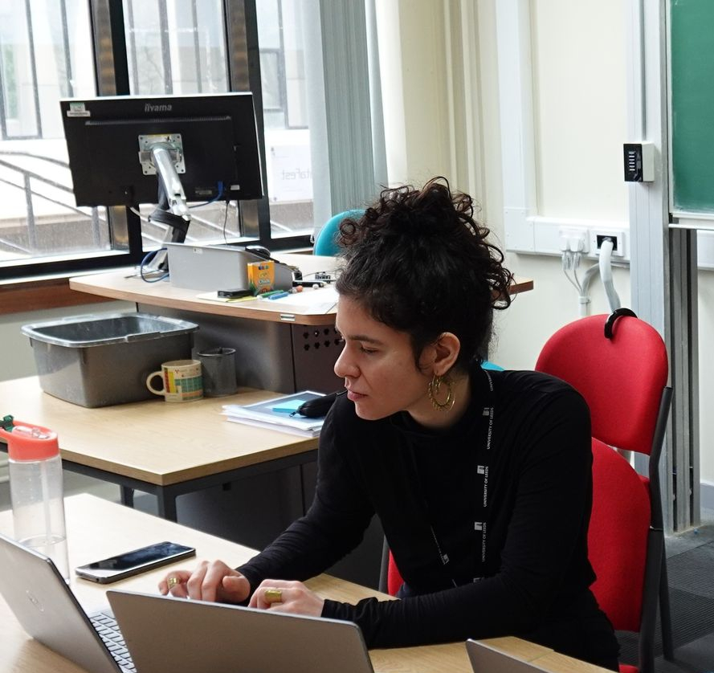

[[Home]](https://anniws.github.io/) 
[[Research]](https://anniws.github.io/Research.html) 
[[CV]](https://anniws.github.io/CV.html) 

Hi there! I am postdoc at the [Microbial Systems Biology Lab](https://msb-lab.github.io/en/) which is hosted in [IPLA](https://www.ipla.csic.es/en/inicio-en/) (part of [CSIC](https://www.csic.es/en)), in Oviedo, Spain. 

I work with mathematical models applied to biological systems. During my PhD with Richard Mann I worked on the evolution of sociality in social decision-making, in the sequential binary decision-making model. Now, I am working on the evolution of microbial populations with Juan Diaz-Colunga; I'm developing a tool that creates fitness landscapes with custom global epistasis.

